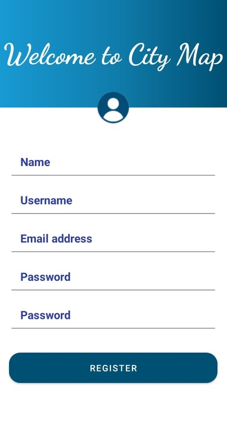
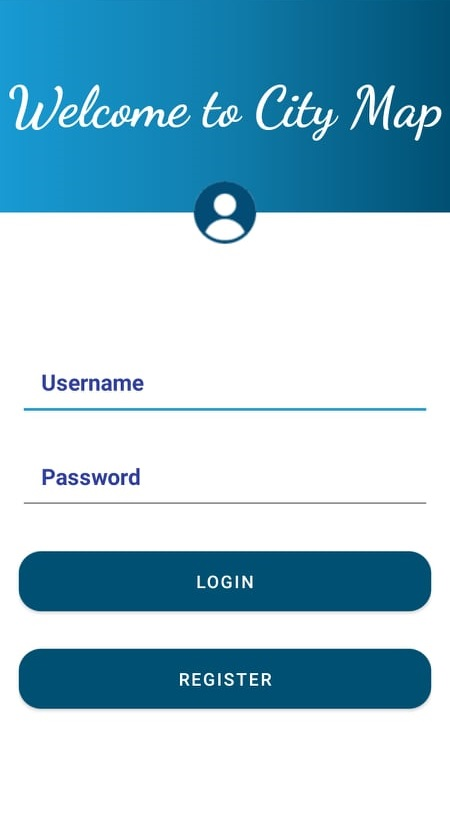
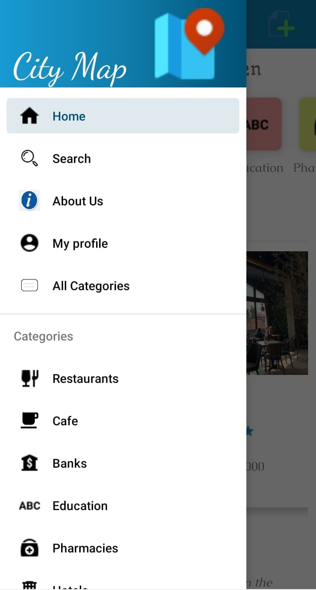
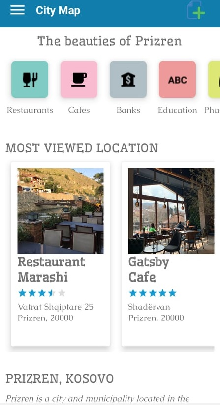
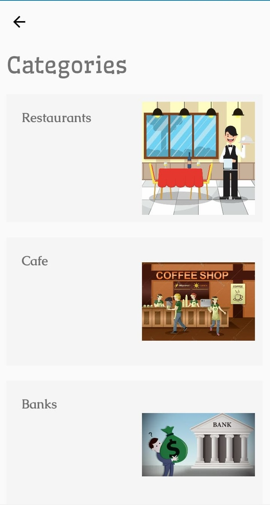
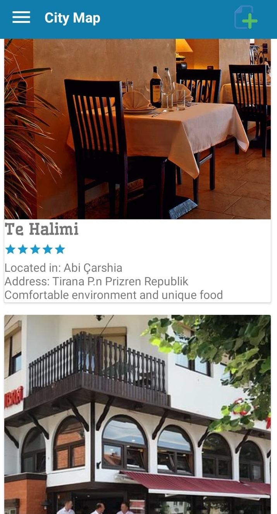
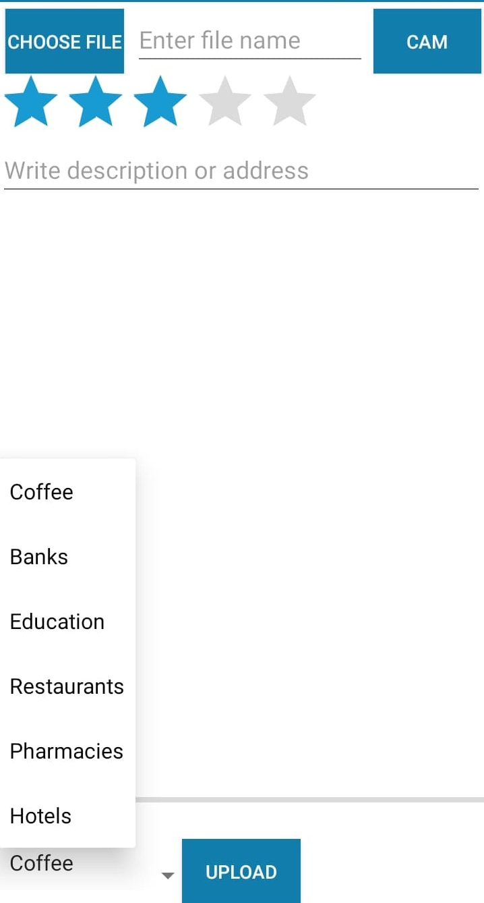
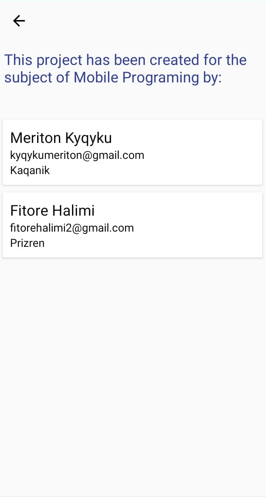
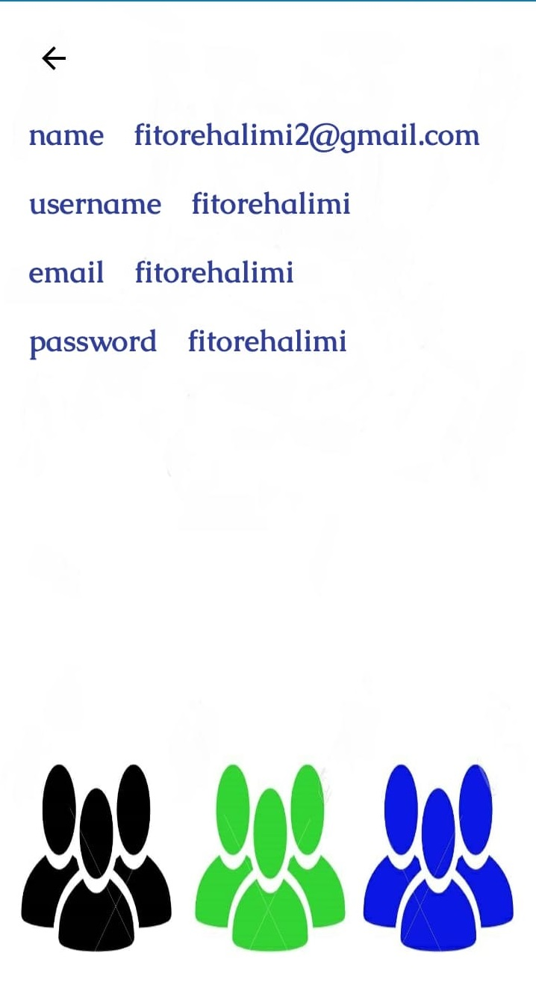

## City Map
CityMap është një aplikacion android, i cili është krijuar për të ndihmuar ata që dëshirojnë të vizitojnë qytetin e Prizrenit. 

Mund të themi që është një lloj udhërrëfyesi që shfaq të gjitha shërbimet e qytetit si restorantet, kafiterit, shkollat, barnatoret, hotelet e bankat. 
Të gjitha këto janë të interpretuara me foto si dhe me një përshkrim. 
## Zhvilluar nga / Developed By
Meriton Kyçyku – kyqykumeriton@gmail.com 

Fitore Halimi – fitorehalimi2@gmail.com
## Mentor
Arbnor Halili
## E ndërtuar me / Built With
•	OOP(Java), Material Design, Fragments, ListView, PageAdapter, CardView, RecyclerView, Animations

•	FireBase – Databaza

•	Picasso – Shkarkimi i fotografive

•	GMaps API – Lokacioni 
## Teknologjia e përdorur
Firebase

•	firebase-databse: 16.0.4

•	firebase-storage: 16.0.4

GMaps API

•	play-services-maps:17.0.0

•	play-services-location:17.0.0
## Screenshots

    

    
